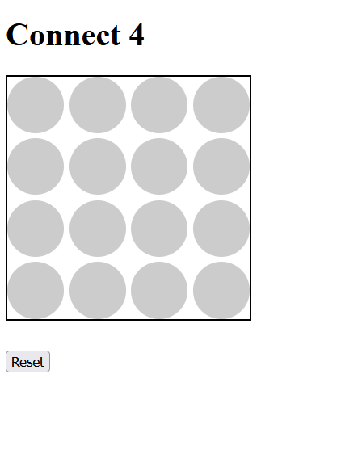
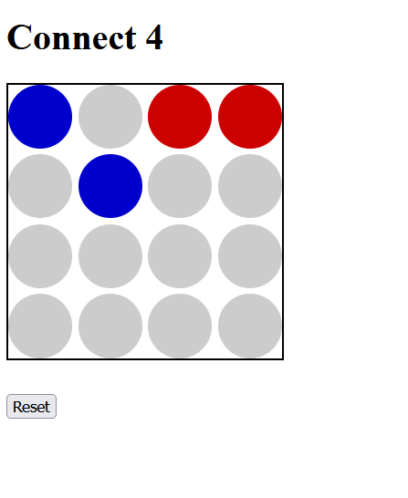
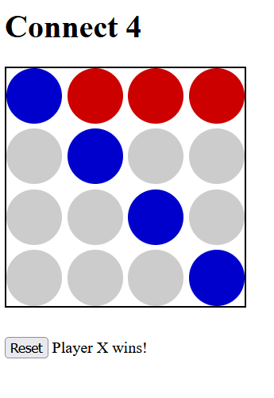

# Connect 4 Web App 🎮

## Overview 🌐

The **Connect 4 Web App** is an engaging, browser-based adaptation of the classic Connect 4 game. It brings the excitement of this timeless game to the web, allowing two players to battle it out on a vibrant, interactive 4x4 grid. Built with HTML, CSS, and JavaScript, the app offers a seamless and enjoyable experience that’s perfect for quick matches or extended gameplay sessions.

## Features ✨

- **Responsive and Intuitive Grid Board:** The game board uses CSS Grid for a clean and responsive design that looks great on any device.
- **Dynamic Gameplay Mechanics:** Players alternate turns by clicking on the grid cells, with real-time updates managed smoothly by JavaScript.
- **Intelligent Win Detection Algorithm:** The app continuously checks for winning conditions (four in a row horizontally, vertically, or diagonally) and provides immediate feedback to players.
- **Easy Game Reset:** A single click on the "Reset" button lets players start a fresh game without reloading the page.
- **Visual Turn Indicators:** The game uses colors to represent players—blue for Player X and red for Player O—making it easy to follow the action.
- **User-Friendly Alerts:** Displays alerts to announce the winner or a tie game, enhancing user engagement.

## Current Design 🖼️

Take a look at the different stages of the game's design:

- **Initial Game State:**
  
  

- **Gameplay in Progress:**

  

- **Winning Announcement:**

  

## How to Play 🕹️

1. **Launch the Game:** Open the web app in your favorite browser. The 4x4 grid will be ready for action!
2. **Take Turns:** Player 'X' kicks off the game. Click on any available cell to place your piece. The game alternates turns automatically between 'X' and 'O'.
3. **Winning or Draw:** The game checks for four aligned pieces after each move. If a player succeeds, a winning message pops up. If all cells are occupied and no player wins, it announces a draw.
4. **Restart Anytime:** Hit the "Reset" button to clear the board and start a new round.

## Installation and Setup 🚀

To run the Connect 4 Web App locally on your machine:

1. **Clone the Repository:**
  https://github.com/omarbasha19/Connect-4-web-app
